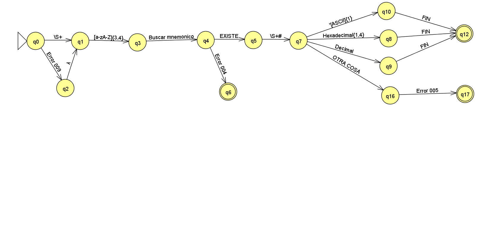

# Compilador-M68HC11
Es un compilador para la materia de Estructura y programación de computadoras implementado en python.

## Compilación explicada en pasos

### Paso 1 Leer el archivo

- Donde se ejecute el programa tiene que existir el archivo, si este no existe , lo crea y termina su ejecución.

  Caso contrario si existe pasa al paso 2.

### Paso 2  Leer archivo y pasarlo a RAM(arreglo)

- Usando el archivo lo pasamos a un arreglo con cada una de las líneas leídas.
- Eliminamos el `\n` al final de cada línea de instrucciones.
- Eliminamos las líneas que están vacías.

### Paso 3 Detectar ¿Qué es?

Cada línea de código tiene que caer en las siguientes categorias:

- Variable o constante =V
- Directiva =D
  - org D1
  - end D2
- Modo operación
  - Inherente =M1
  - Inmediato =M2

En caso de que no tenga la forma deseada de la instrucción, tendrá  que regresar que tipo de error es.

- Errores
  - 

## Ejemplo

``````python
linea='  ORG  $8000'

``````

#### Errores de acuerdo al modo

##### Indexado

- 

## Detección

### Inherente


**Errores detectado**

- 004  MNEMÓNICO INEXISTENTE
- 006  INSTRUCCIÓN NO LLEVA OPERANDO(S)
- 009  INSTRUCCIÓN CARECE DE ALMENOS UN ESPACIO RELATIVO AL MARGEN

### Inmediato



- Si llega a `q12` es éxito.

**Errores detectados**

- 004  MNEMÓNICO INEXISTENTE
- 005  INSTRUCCIÓN CARECE DE OPERANDO(S)
- 007  MAGNITUD DE OPERANDO ERRONEA (Detección,Pre-compilación)
- 009  INSTRUCCIÓN CARECE DE ALMENOS UN ESPACIO RELATIVO AL MARGEN
- 011 MÁS OPERANDOS DE LOS NECESARIOS (EXTRA).

### Directo


#### Errores detectados

- 004  MNEMÓNICO INEXISTENTE
- 005  INSTRUCCIÓN CARECE DE OPERANDO(S)
- 007  MAGNITUD DE OPERANDO ERRONEA (Detección,Pre-compilación)
- 009  INSTRUCCIÓN CARECE DE ALMENOS UN ESPACIO RELATIVO AL MARGEN

### Extendido


### Indexado


- Si llega a **q10** es éxito.
- Se tiene que hacer dos archivos diferentes, uno `indexadoX.py`, `indexadoY.py` para identificar en cualquiera de los dos casos.

#### Errores detectados

- 004  MNEMÓNICO INEXISTENTE
- 005  INSTRUCCIÓN CARECE DE OPERANDO(S)
- 007  MAGNITUD DE OPERANDO ERRONEA (Detección,Pre-compilación)
- 009  INSTRUCCIÓN CARECE DE ALMENOS UN ESPACIO RELATIVO AL MARGEN

### Relativo


### Org


#### Errores detectados

- 005  INSTRUCCIÓN CARECE DE OPERANDO(S)
- 007  MAGNITUD DE OPERANDO ERRONEA (Detección,Pre-compilación)
- 009  INSTRUCCIÓN CARECE DE ALMENOS UN ESPACIO RELATIVO AL MARGEN

###  Variables y constantes


### End	


### Global


### Proceso Compilación global


# Base de datos

Modos:

1. Inherente
2. Inmediato
3. directo
4. Indexado X
5. Indexado y
6. Relativo
7. Extendido

## Ejemplo uso

La base de datos esta en un paquete


ubicación con respecto al archivo `main_pruebas.py`


````python
import DataBase.BaseDatos as bd
import DataBase.BdRow as bdRow


valor:bdRow.BdRow= bd.bdSearch('aba',1)
print(type(valor.byte))
print('bytes: ' + str(valor.byte))
print('---------------------')
print(type(valor.ciclo))
print('ciclos: ' + str(valor.ciclo))
print('---------------------')
print(type(valor.id))
print('Id: ' +str(valor.id))
print('---------------------')
print(type(valor.mod))
print('Modo: ' +str(valor.mod))
print('---------------------')
print(type(valor.no))
print('No. ' + str(valor.no))
print('---------------------')
print(type(valor.opcode))
print('Opcode ' +valor.opcode)
print('---------------------')
print(type(valor.mnemonico))
print('Mnemonico ' +valor.mnemonico)
print(valor)
````

Ahora veamos el resultado


# Precompilar

### Inherente


# Inmediato


# Directo / Extendido

- La diferencia entre ambos el tamaño del operando , y la búsqueda de mnemonico en la base de datos.


# Indexado


# Relativo


- Recuerda que el `pcActual` es el pc actual de la siguiente instrucción, este caso sería `8002`

## Ejemplo


La primera linea es donde esta **la etiqueta** , la segunda linea es el `pcAcutal de la siguiente instrucción`  Entonces la resta es `8003-800B +1`

# Soportan etiquetas

- Extendio

```
INICIO org $8000
jmp INICIO == jump HEX(8000) = jump 8000
```


# Resultado de compilación entendible para humano


# Resultado de compilación entendible para máquina S19	

# Uso

1. Busca si existe un archivo llamado `input.asc` con codificación ANSI lo lee en caso de que no exista, le crea un archivo con el nombre y se cierra.			
2. A:\EyPC_Proyecto_1\ManipulacionArchivos

# Documentación

## Archivos para probar el 


# Resultado compilación

## Puro inerente


## Puro inmediato